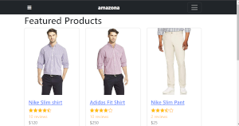
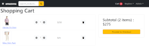

    <h3 align="center">Amazona - E-commerce Site</h3>

## License

## Description

This is a single-page MERN Stack application. This site was built from a tutorial with some modificuations to separate the back end routes and controllers. This site allows a vender to create products with product images stored on Cloudinary.com. Users can sign up and purchase produdts using the PayPal API.

The site admin can view users, orders, and see graphs of sales data in the admin section.

[View the portfolio on Heroku](https://judo2000-react-portfolio.herokuapp.com/)

## Table of Contents

- [License](#license)
- [Description](#description)
- [Installation Instructions](#installation-instructions)
- [Usage](#usage)
- [Contributors](#contributors)
- [Testing](#testing)
- [Questions](#questions)

  
(<a href="#top">back to top</a>)

## Installation Instructions

  <ul><li>Clone this repository by entering the following command from the command line: <code>https://github.com/judo2000/amazona-2.git</code></li><li>Change (cd) into the newly created directory</li><li>From the command line enter: <code>npm i</code> to install all necessary packages</li><li>From the command line enter: <code>npm run dev</code> to run the application</li>
  
  
(<a href="#top">back to top</a>)

  
  ## Usage
  
  This application will allow users to buy and sell products on an amazon like clone website with product images stored on Clousinary.

  
(<a href="#top">back to top</a>)

  
    
  ## Contributors
  None

  
(<a href="#top">back to top</a>)

## Testing

There are not tests for this application.

  
(<a href="#top">back to top</a>)

## Questions

Github: [judo2000](https://github.com/judo2000) 

Email: [judo2000@comcast.net](judo2000@comcast.net)

  
(<a href="#top">back to top</a>)

